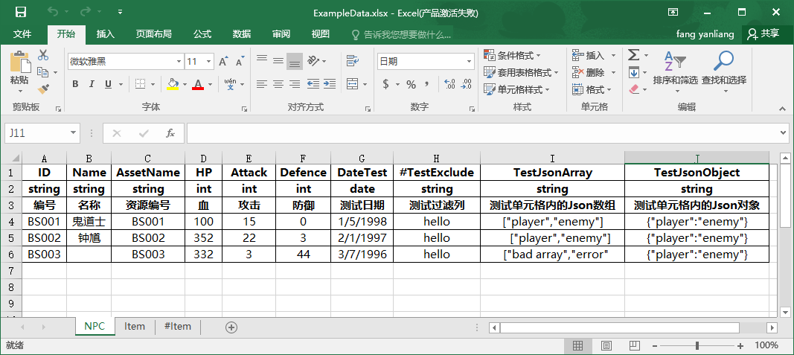
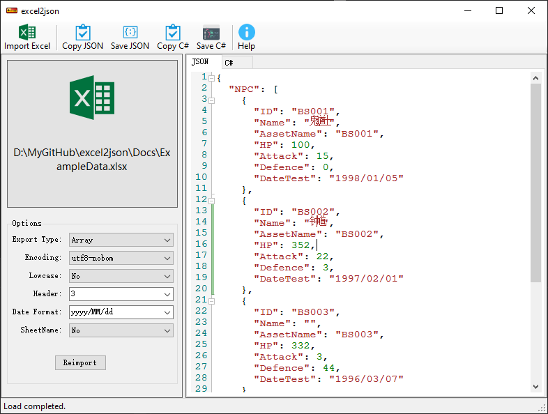
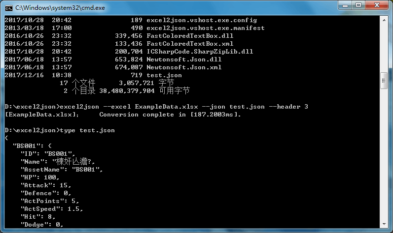

# excel2json

详细帮助文档请见：[https://neil3d.github.io/coding/excel2json.html](https://neil3d.github.io/coding/excel2json.html)

## 命令行参数

* -e, –excel Required. 输入的Excel文件路径.
* -j, –json 指定输出的json文件路径.
* -h, –header Required. 表格中有几行是表头.
* -c, –encoding (Default: utf8-nobom) 指定编码的名称.
* -l, –lowcase (Default: false) 自动把字段名称转换成小写格式.
* -a 序列化成数组
* -d, --date:指定日期格式化字符串，例如：dd / MM / yyy hh: mm:ss
* -s 序列化时强制带上sheet name，即使只有一个sheet
* -exclude_prefix： 导出时，排除掉包含指定前缀的表单和列，例如：-exclude_prefix #
* -cell_json：自动识别单元格中的Json对象和Json数组，Default：false

  
  
  

